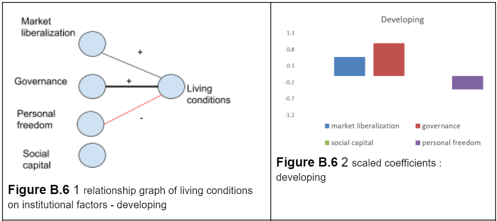

# Dynamic role of the state

In this section

1. [Understanding nonlinearity](dynamic-role-of-the-state.md#dynamic-role-of-government)
2. [Relationship dynamics depend on development stage](dynamic-role-of-the-state.md#relationship-dynamics-depend-on-development-stage)
3. [Three roles of the state : leader, enabler, safeguard](dynamic-role-of-the-state.md#three-roles-of-the-state-leader-enabler-safeguard)

Having examined the outcomes in the first domain of the Legatum Prosperity - empowering people, the next step is to analyze the relationships in the other two domains of the Prosperity Index - inclusive society and open markets. One way of interpreting this analysis is one of cause and effect. What is the relationship between endogenous conditions - institutions and policy of markets and government to desired outcomes - labor productivity, health, education, provision of living conditions and environmental conservation?

Four institutional Pillars are selected and presented in Table B.4. The Market liberalization Pillar is hybridized draws from several Elements in different Pillars the Legatum Prosperity Index which are closely related to the Economic Freedom Index and measure policies, as opposed to econometric outcomes like GDP per capita and inflation. Only the Elements of the Pillars are listed and the detailed measures can be found in the Legatum Methodology report \(Legatum Institute, 2019\).  The results of the regression analysis are presented in Figure B.4.

## Understanding non-linearity

As expected based on the graph of Economic Freedom Index and the Legatum Prosperity at the beginning of this Appendix there is a strong positive link between market liberalization and living conditions.  These relationships may not be uniform over all stages of development and in a number of cases there appears to be different regions - a high correlated region and a low correlated region, with some parameters having the high correlated region at high levels of development - thresholding, and other parameters with high correlation in the low level of development - diminishing marginal returns.  The prompt for this suspicion is illustrated in Figure B.5, where an example of threshold is presented with living conditions and personal freedom, where the left hand side is an uncorrelated region compared to the right-hand side.  This is in contrast to the diminishing marginal return where the opposite is observed and the left-hand side while diffuse still has a general pattern of correlated relationship, and while the variance decreases, the correlation weakens in the right hand side. There could be several explanations for this observation. First there could be constraints. For example it becomes harder to achieve greater gains in longevity for the same amount of resources invested as there are biological limits to how long a person can live.  Another explanation could be shifting preferences.  Societies reach different development milestones, the needs and preferences may shift as individuals move from material needs to social, psychological dimensions of well-being.  

## Relationship dynamics depend on development stage

The first step is to define development.  The longevity Element is selected because it is closely associated with the Human development index and is selected to define development stages. Countries are grouped into three categories based on their Longevity score - Developing \(DVPNG\) Emerging \(TSN\) and Advanced \(DVP\).

The analysis from Figure B.4 is repeated for the three classifications of development and results presented in Figure B.6 show some evidence that the relationship patterns are not uniform and do shift with development stage.  The results in Figure B.6 appear different from B.4 where the strongest relationship to market liberalization is observed during the transition period, and in the early and later stages of development governance shows up as a stronger relationship.  The negative relationship of living conditions of social capital and personal freedom is unexpected and deserves more detailed analysis to understand whether it is an anomaly of the measurement or a true phenomenon, and if so what its cause could be. 

## Three roles of the state : Leader, enabler, safeguard

One description of the switching roles of governance with the market was presented during a panelist discussion by Singapore Minister of the Ministry of Trade and Industry -- Chan Chun Sing at the St Galen Symposium in 2016. He describes three roles of the government - “leader”, “enabler” and then “safeguard”.

_What the government needs to do depends on the stage of development. Depending on the development stage the government can play three roles to varying degrees._  

1. _One is to lead - to lead because there are market failures - the market is not actually working._ 
2. _The second if the market is working and the people have the basic ingredients then your job is to enable, to enable a partnership to unleash the potential of our people, and_ 
3. _then there is a third role in a more mature market you may want to play the role of safeguarding. Safeguarding the opportunities for the next generation to unleash their potential._  

_These three are not either or, at any stage of development every government will have to do all these three in varying proportions.  Arguably in a less developed economy it may need to do more of leading. In a more mature economy you may need to do less leading and more enabling._    
**-** Chan Chun Sing, Minister for Singapore Ministry of Trade and Industry  
13 May 2016 St Gallen Symposium

  

